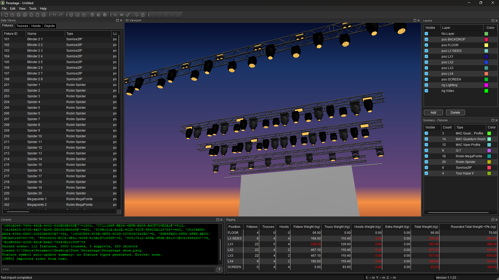

# Perastage



**Perastage** is a desktop application for lighting designers and technicians built in C++20.  It reads, organises and visualises show data using the **MVR** (My Virtual Rig) format and **GDTF** (General Device Type Format).  The graphical user interface is written with **wxWidgets** and the 3D/2D rendering is performed with **OpenGL**.

> **Status:** active beta. Core workflows (MVR import/export, editing, layout/printing, and table tooling) are usable and under continuous stabilization. Some advanced and experimental tools remain build-gated or workflow-specific.

---

## Main features

### Project management

- Open and save Perastage projects (`*.pstg`) with support for multiple named pages/layouts.
- Group fixtures, trusses, hoists and scene objects into layers and toggle their visibility/selection per layer.
- Save and restore user preferences (window layout, last used directories, view mode, etc.).

### Fixture, truss, hoist and object model

- Internal data model for fixtures, trusses, hoists (supports) and generic scene objects with unique identifiers.
- Layers allow you to organise elements and assign colours per layer; layers are used in both the 3D/2D viewers and the printing/export pipeline.
- Scene objects include basic geometry and transform helpers for positioning, rotating and scaling elements in space.

### MVR & GDTF support

- **Import MVR 1.6** scenes: read fixtures, trusses, hoists and generic objects from `.mvr` files and build the internal scene graph.
- **Official `.mvr` open policy (menu import and OS double-click):** Perastage first asks to save unsaved changes, then opens the `.mvr` using a clean-scene reset + import flow (not merge). The same progress UI/locking behavior is used in both entry points (`wxWindowDisabler` + `wxBusyInfo`) so the workflow remains consistent.
- **Export MVR**: write the current scene back to a new `.mvr` file so it can be opened in other lighting software.
- **GDTF integration**:
  - A built‑in fixture dictionary maps textual fixture descriptions to GDTF files stored in the `library/` directory.
  - Geometry loaders parse embedded GDTF models for preview and rendering in the 3D viewer.
  - Online lookup: download fixtures from **GDTF‑Share** via the *Tools → Download GDTF fixture* dialog.
  - Exported MVR packages store referenced GDTFs under `gdtf/` inside the archive and `GDTFSpec` always uses archive‑relative forward‑slash paths.
  - If two different GDTF files share the same filename, export auto‑renames collisions deterministically (`name (1).gdtf`, etc.) and updates each `GDTFSpec` reference.
  - Parametric objects exported as Fixture/Truss/Support receive non-empty `FixtureID` + globally unique `FixtureIDNumeric` values across the scene.

### Rider import from text or PDF

- Import simple lighting riders from plain text or PDF documents using the **Tools → Create from text** dialog.
- The dialog provides an **Apply filter** action that replaces the editor text with the parsed fixture-only result before you press **Create**.
- The rider importer parses typical lists of fixture quantities/types and creates corresponding dummy fixtures/trusses in the scene.
- Truss hang tokens can include optional coordinates in parentheses to override
  default truss placement in **Create from text** (numeric values follow the
  active distance unit system: meters/feet), including hang headers such as
  `LX1 (7)` / `LX1 (7):`.
- In text import, `CALLES`/`SIDES` hang headers map to `LX SIDES` and support mirrored side-truss/fixture placement workflows.
- The full parser and placement rule set used by this text-to-scene workflow is documented in [`docs/text_to_scene_rules.md`](docs/text_to_scene_rules.md).
- A dictionary helps resolve type names to GDTF specifications and can be edited via the **Tools → Edit dictionaries** menu.
- Dictionary import/export now supports three portability levels:
  - JSON snapshot (references only, backward compatible),
  - JSON snapshot + optional copied `assets/` folder (`*_assets/assets/...`),
  - portable ZIP bundle (`manifest.json` + `dictionary.json` + `assets/*`).
- Import/export flows include preflight path validation and report missing referenced files before applying changes.
- When importing files into `library/fixtures` or `library/trusses`, filename collisions with different content prompt a policy (rename/overwrite/cancel).

### Patch management

- Manage DMX universes and addresses for fixtures via table dialogs.
- **Auto patch** tool groups fixtures by hang position and type and assigns DMX channels sequentially across universes.
- Manual patching is supported via the address and mode editors.

### Colour and type helpers

- **Auto color** assigns colours to layers and fixtures based on their type; truss layers default to light grey.  Existing colours are preserved if explicitly set.
- **Convert to Hoist** converts selected fixtures into hoists/supports in the scene, retaining positions and names.

### Views and layout system

- **3D Viewer:** inspect trusses, fixtures, hoists and scene objects in a real‑time OpenGL viewport.  Camera controls include orbit, pan, zoom and preset views.
- **2D Viewer:** top‑down plan view with grid, axis indicators and label options.  You can capture the vector draw commands for export (see `Viewer2DPanel::RequestFrameCapture()` in the API).
- **Layout mode:** create multiple printable layout pages containing 2D views, legends, event tables, text boxes and images.  Layout orientation (portrait/landscape) and element ordering are editable via the Layouts panel.  The underlying `LayoutManager` API supports adding, renaming, deleting and ordering views and legends.
- **Summary and rigging panels:** display counts and basic statistics for fixtures/trusses/hoists/objects and highlight missing weight data.
- **Layer panel:** lists scene layers and allows switching the active layer for newly created items.

### Printing and export

- **Print Viewer 2D (Debug builds):** print the current 2D view directly to PDF with configurable page size and orientation. In Release builds this dialog is intentionally hidden behind `ui::FeatureFlag::PrintViewer2DDialog`.
- **Print Layout:** print the active layout to PDF, including 2D views, legends, event tables, text and images.
- **Print Table:** print any of the data tables (fixtures, trusses, hoists, objects) or export them to CSV via **File → Export CSV**.
- **Export Fixture/Truss/Object:** export selected items to stand‑alone GDTF/GTRUSS or object files via the Tools menu.
- **Layout PDF output:** export complete documentation sheets that combine viewport captures, legends, event tables, text, and image elements on named pages.

### GUI helpers

- **Build-gated tools:** some menu entries are intentionally Debug-only (for example *Print Viewer 2D* and *Generate fixture symbols*) to keep Release builds focused on production-safe workflows.
- Tables for fixtures, trusses, hoists and objects support multi‑row editing shortcuts: sequential fills, range interpolation (`1 10` / `1 thru 10`), relative edits (`++0.5`, `--15`), etc.
- Console panel for status messages and command‑line operations (e.g. selecting fixtures or trusses via textual commands).
- Preferences dialog to set default directories, units and other settings.
- UI units can be switched independently for distance and weight (**Edit → Preferences → Units**). Internally, distances remain canonical in **mm** and weights in **kg**; metric/imperial affects input parsing and display/labels only. See [`docs/ui_unit_systems.md`](docs/ui_unit_systems.md).
- Login dialog stores encrypted credentials for GDTF‑Share downloads.

---

## Repository layout

The most important directories are:

| Path | Purpose |
|------|---------|
| `main.cpp` | Application entry point (initialises wxWidgets and the main window). |
| `core/` | Core logic and utilities: configuration, logging, rider importer, auto‑patcher, dictionaries, PDF/text helpers, layout and printing helpers, etc. |
| `core/layouts/` | Layout system definitions and manager for printable pages. |
| `core/print/` | Print and PDF export helpers for tables, layouts and viewers. |
| `gui/` | wxWidgets panels, dialogs and the main window: tables, viewers, panels, dialogs and menus. |
| `models/` | Data structures describing the scene: fixtures, trusses, hoists, layers and matrices. |
| `mvr/` | Importers/exporters for the MVR format. |
| `viewer3d/` | 3D rendering engine, camera controls and mesh loaders. |
| `viewer2d/` | 2D plan view renderer and capture utilities. |
| `third_party/` | Vendored third-party headers (for example `json.hpp`) kept separate from project modules. |
| `library/` | Built‑in data: fixture dictionary, default trusses, textures, scene objects and example projects (`library/scene_objects/`, etc.). |
| `resources/` | Application icon, Windows resource script and additional images (including `perastage3d.png` for this README). |
| `tests/` | Unit tests using Catch2. |
| `docs/` | Informal documentation and specs (MVR/GDTF notes). |

For a detailed explanation of each file see `perastage_tree.md`.

For repository conventions (modules, third-party code, and CMake structure), see `docs/architecture.md`.

---

## Building

Perastage uses **CMake** and targets C++20.  Build dependencies include `wxWidgets` (core/base/aui/gl/html), `tinyxml2`, `OpenGL/GLU`, `GLEW`, `CURL`, `nanovg` and `PoDoFo`.  On Windows you can use **vcpkg**, **MSYS2** or similar; on Linux/macOS use your system package manager or vcpkg.

Configure and build:

```bash
mkdir build
cd build
cmake ..
cmake --build .
```

The `perastage_stage` target (Release configuration) stages runtime resources into `out/install/<CONFIG>` (for example `out/install/Release`) ready for packaging with Inno Setup.  Use `perastage_symbols` to collect `.pdb` files for crash analysis on Windows.

Run tests from the build directory with `ctest` to execute unit tests.

### Optional Peraviz and DMX integration

Perastage includes an optional **Peraviz** viewer and DMX/Art‑Net receiver built on top of the Godot engine. These components are off by default and require extra dependencies.

- To enable the native Peraviz subtarget, configure CMake with `-DPERAVIZ_ENABLE_NATIVE=ON`. This target uses Python 3 to generate bindings during the build; make sure Python 3 is installed and discoverable.
- To enable DMX/Art‑Net reception within the Peraviz viewer, pass `-DPERAVIZ_ENABLE_DMX=ON` in addition to the above option.

These options are considered experimental and are not required for the core Perastage application. See `peraviz/` for details.

### Project file format

Perastage project files (`*.pstg`) are standard ZIP archives. A project typically contains a `config.json` file storing user preferences and layout settings and a `scene.mvr` file storing the show data in MVR format. You can inspect or extract these files with any ZIP utility. When Perastage saves a project, it writes the updated `config.json` and `scene.mvr` back into the archive.

---


## Manual shading verification (MVR)

To verify flat-shading consistency after importing MVR scenes:

1. Build and run the app, then import an `.mvr` file that contains repeated sloped surfaces (for example roof planes).
2. In the 3D viewer, keep solid rendering enabled and inspect surfaces with the same tilt angle.
3. Confirm they receive consistent grayscale shading (no random white/gray mismatch on equally oriented planes).
4. Load a representative GDTF fixture and confirm rendering is unchanged compared to previous behavior.

These checks validate that per-instance normal transformation and mirrored-transform winding correction are working as expected.

---

## Windows packaging

The **official Windows installer** is Inno Setup and the repository script is:

- `packaging/windows/Perastage.iss`

Packaging flow:

1. Build the Release configuration.
2. Run the `perastage_stage` target to populate the staging directory (`out/install/<CONFIG>`, for example `out/install/Release`).
3. Compile `packaging/windows/Perastage.iss` with Inno Setup.
4. In the installer task page, choose optional file associations:
   - `.pstg` (Perastage project files)
   - `.mvr` (`assoc_mvr`, optional import-oriented double-click flow)
5. Optionally provide a portable ZIP archive for users who prefer not to run an installer.

Notes:

- The installer writes associations under `Software\Classes` using ProgID/OpenWith entries and `ChangesAssociations=yes`.
- Uninstall is intentionally conservative for extension ownership: it removes Perastage OpenWith/ProgID entries without forcing aggressive global cleanup of extension owners.
- Legacy CPack/NSIS wiring is kept only as a compatibility path and is not the official installer workflow.

## Linux desktop integration

Linux installs now include:

- `share/applications/perastage.desktop` with `MimeType=application/x-perastage-mvr;application/x-perastage-project;`
- `share/mime/packages/perastage-mime.xml` with glob rules for `*.mvr` and `*.pstg`
- `share/icons/hicolor/1024x1024/apps/perastage.png`

During `cmake --install`, Perastage also attempts to refresh MIME and desktop databases (`update-mime-database` and `update-desktop-database`) so new associations are visible without manual cache refresh.

## macOS document association

On macOS, Perastage builds as an app bundle with `CFBundleDocumentTypes` and UTI declarations for `.mvr`, so Finder can route `.mvr` files to Perastage.

---

## Windows build troubleshooting

If you hit `LNK1163: invalid selection for COMDAT section` on Windows, it usually
means stale object files were produced by a different MSVC toolset or with
incompatible link settings. Do a clean rebuild:

1. Delete the affected build directory (for example, `out/build/x64-Debug`).
2. Re-configure CMake and rebuild the target.
3. If you keep the build directory, use `cmake --build . --config Debug --clean-first`
   (or the corresponding configuration) to force a clean rebuild.

If Visual Studio shows many **`Error (inactive)`** diagnostics such as:

- `std has no member filesystem / optional / variant / string_view / get_if / bit_cast`
- structured-binding parse errors near `for (const auto& [a, b] : ...)`
- follow-up parser errors (`expected ';'`, `expected ']'`, unknown identifiers)

the active IntelliSense profile is usually not using C++20 yet (or is attached to
an outdated CMake cache). This project requires **C++20**.

Recommended fix sequence:

1. Remove the current build directory (for example `out/build/x64-Debug`).
2. Re-configure with CMake from a Developer PowerShell:
   ```powershell
   cmake -S . -B out/build/x64-Debug -G "Visual Studio 17 2022" -A x64
   ```
3. Build explicitly with that configured tree:
   ```powershell
   cmake --build out/build/x64-Debug --config Debug
   ```
4. In Visual Studio, open the CMake project/folder tied to that build directory
   and wait for IntelliSense to finish reindexing.

If the diagnostics are still marked as **inactive**, prioritize the real compiler
output from `cmake --build`; inactive diagnostics alone do not necessarily mean
the code fails to compile.

### Visual Studio Code IntelliSense alignment (Windows/macOS)

If VS Code shows parser cascades like:

- `std has no member optional / variant / filesystem / string_view / bit_cast`
- `cannot deduce auto`
- `expected ';'`, `expected ']'`, unknown identifiers
- errors inside SDK headers such as `.../c++/v1/__config`

the editor is usually parsing files without the active CMake configuration.
This repository now includes workspace settings that force VS Code C/C++
IntelliSense to read build settings from **CMake Tools** and use **C++20**.

Recommended VS Code flow:

1. Install the recommended extensions (`ms-vscode.cpptools`, `ms-vscode.cmake-tools`).
2. Run **CMake: Select Configure Preset** and choose the preset for your host:
   - Windows: `win-x64-debug` / `win-x64-release` (or Ninja variants)
   - macOS: `mac-arm64-debug` / `mac-arm64-release`
3. Run **CMake: Configure**.
4. If stale diagnostics remain, delete the selected preset build directory and
   configure again to regenerate IntelliSense inputs.

Important: if `cmake --build` succeeds but VS Code still reports semantic
errors, trust the compiler output first; this indicates IntelliSense cache/tooling
misalignment, not necessarily a cross-platform source incompatibility.

---

## macOS build troubleshooting (Apple Silicon)

If CMake fails with messages like:

- `CMake was unable to find a build program corresponding to "Ninja"`
- `CMAKE_CXX_COMPILER not set, after EnableLanguage`

it usually means the build toolchain is incomplete in that Mac setup (not a source-code error in Perastage).

Install the missing tools:

```bash
xcode-select --install
brew install cmake ninja
```

Then verify:

```bash
xcode-select -p
clang++ --version
ninja --version
cmake --version
```

If you use VS Code + CMake Tools:

1. Open `Cmd+Shift+P` → **CMake: Select a Kit** and choose an Apple Clang kit (arm64).
2. Ensure the configure preset/generator matches your environment (`Ninja` if Ninja is installed).
3. If you changed toolchains or kits, delete the existing build directory (for example `build/mac-arm64-debug`) and configure again.

When using vcpkg on Apple Silicon, keep the triplet consistent with your configure command (`-DVCPKG_TARGET_TRIPLET=arm64-osx`).

---

## Known limitations / experimental areas

- **Beta quality:** many functions in the menu (especially under Tools and Layouts) are placeholders or only partially implemented.  Error handling and input validation are minimal.
- **Performance:** the 3D renderer is not yet optimised for very large scenes.  The 2D viewer redraws the entire scene on each change.
- **Incomplete importers/exporters:** only MVR 1.6 is supported; other scene formats (e.g. LXFree, Vectorworks) are not yet supported.  Exporting complex layouts to other software is untested.
- **Lack of undo/redo across some operations:** while undo/redo is provided for most editing actions, some layout operations might not be undoable.
- **Planned features:** grouping/filtering by layer, 2D plan generation from text, automatic layout generation from simple instructions, deeper GDTF integration and improved rider import are on the roadmap.

If you encounter bugs or have suggestions please open an issue with:

- What you were attempting to do.
- Steps to reproduce the problem.
- Any relevant rider/project/MVR files (if possible).

---

## Author & License

Perastage is developed and maintained by **Luisma Peramato** (GitHub user `PeramatoG`).  It is distributed under the **GNU General Public License v3.0**.  Third‑party libraries are used under their respective licences; see `THIRD_PARTY_LICENSES.md` and the files in the `licenses/` directory for details.
